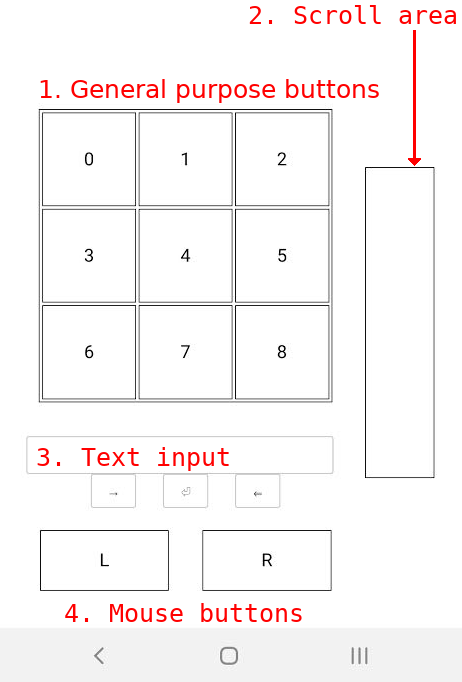

# remote-mouse

This project allows one to use a smartphone as a pointing device for a computer (say, a raspberry pi working as media server) in a similiar fashion to certain smart tvs remotes. There is also some limited text input capability.

## Requirements

- python3
- tornado
- pyautogui
- a smartphone capable of providing [device orientation](https://developer.mozilla.org/en-US/docs/Web/API/Detecting_device_orientation)

## Installation

```shell
git clone https://gitlab.com/camposm/remote-mouse
```
Next, create a folder named "keys" inside "src" and generate a self signed certificate (e.g. [this](https://www.akadia.com/services/ssh_test_certificate.html)).

## Usage

On the machine to be controlled:
```shell
./remote_mouse.py <port>
```

On the smartphone, access `https://machine-ip:port`.



(I know..)

The interface is divided into 4 parts:
1. General purpose buttons - customizable through the use of `button_down` and `button_up` callbacks. 
2. Scroll area - sends **vertical** scroll events
3. Text input - type on this field and click on `→` to send the text to current active text field. Use `⏎` to press Enter and `⇐` for backspace
4. Mouse buttons - left and right buttons

## Limitations

- Current implementation is capable of delivering a reasonable experience after getting used to system dynamic
- Mouse movement is a bit jerky and could use some filtering, specially when during clicks 
- No way to fine tune sensitivity, button names, available buttons, etc for now
- Inteface is grotesque and everything was made to fit my phone, so this could definitely be improved
- Does not work on Safari


